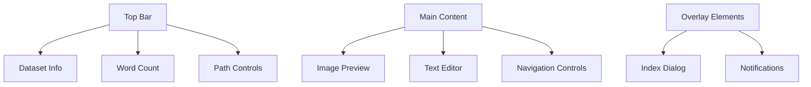
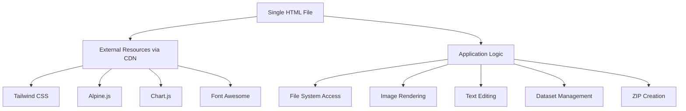

# Captioneer-TINS

<!-- Zero Source Specification v1.0 -->
<!-- ZS:COMPLEXITY:MEDIUM -->
<!-- ZS:PLATFORM:WEB -->
<!-- ZS:LANGUAGE:JAVASCRIPT -->

## Description

Captioneer-TINS is a specialized web application designed for researchers and artists who work with image-text pair datasets for training generative text-to-image models. This single-file HTML application enables users to efficiently browse through paired image and text files, view images, edit associated captions, and save changes while automatically maintaining backups of the original text data. The application provides a streamlined workflow for dataset refinement, helping users improve the quality of their training data with minimal friction.

## Functionality

### Core Features

- **Dataset Loading**: Load image-text pair datasets from a user-defined folder path
- **Image Preview**: Display the current image in a centered view occupying half of the screen
- **Caption Editing**: Edit text captions in a dedicated text area with word count display
- **Navigation**: Browse through the dataset using next/previous buttons or a quick-access index
- **Save Functionality**: Save edited captions back to the original text files
- **Automatic Backups**: Create timestamped ZIP backups of all text files upon dataset loading
- **File Management**: Navigate datasets using both file browser and manual path input options

### User Interface

The application features a responsive, minimalist dark-themed interface divided into the following main components:

#### Top Bar
- Dataset information display (folder name, total pairs, current position)
- Word count indicator for the current caption
- Dataset loading controls (path input and folder browser button)

#### Main Content Area
- Image preview section (centered, top half of the screen)
- Text editor section (bottom half of the screen)
- Navigation controls (previous/next buttons with visual icons)

#### Additional UI Elements
- Quick-access dataset index in a scrollable dialog/panel
- Status notifications for operations (saves, backups, errors)



### Behavior Specifications

#### Dataset Loading
1. When the user enters a path or uses the folder browser:
   - The application scans the selected directory for image-text pairs
   - Pairs are identified by matching filenames with .png and .txt extensions
   - A backup ZIP file of all .txt files is created in a "/source/" subdirectory with a timestamp
   - The first image-text pair is loaded and displayed
   - The total count of valid pairs is shown in the interface

2. If no valid pairs are found:
   - Display a notification indicating no valid pairs were found
   - Prompt the user to select a different directory

#### Navigation
1. Next/Previous buttons:
   - Load the next/previous image-text pair in the sequence
   - Update the position indicator in the interface
   - If at the beginning/end of the dataset, disable the respective button

2. Index access:
   - Open a scrollable list of all available pairs when activated
   - Allow direct navigation to any pair by selection
   - Display the filename for each pair in the list

#### Editing and Saving
1. Text editing:
   - Update the word count display as the user types
   - No special formatting, just plain text editing

2. Save functionality:
   - Write the current text editor content to the corresponding .txt file
   - Display a confirmation notification upon successful save
   - In case of an error, show an error notification with details

#### Error Handling
1. Missing files:
   - If an image file is missing but the text file exists, display a placeholder image
   - If a text file is missing but the image exists, create an empty text file
   - Show a notification about the missing file
   - Automatically move to the next valid pair if navigation is affected

2. Invalid paths:
   - Display clear error messages for inaccessible or invalid directories
   - Maintain the current dataset if already loaded

## Technical Implementation

### Architecture

The application is implemented as a single HTML file that includes all necessary functionality through CDN resources:



This architecture ensures the application is entirely self-contained, requiring only a browser to run with no server-side dependencies.

### Data Structures

#### Dataset Management
```javascript
{
  currentPath: string,         // Path to the current dataset directory
  pairs: [                     // Array of all valid image-text pairs
    {
      baseName: string,        // Base filename without extension
      imagePath: string,       // Full path to the image file
      textPath: string,        // Full path to the text file
      text: string | null,     // Cached content of the text file
      imageLoaded: boolean     // Flag indicating if the image is loaded
    }
  ],
  currentIndex: number,        // Index of the currently displayed pair
  totalPairs: number,          // Total number of valid pairs
  wordCount: number            // Word count of current text
}
```

#### Backup System
```javascript
{
  backupPath: string,          // Path to the backup directory
  backupHistory: [             // Array of created backups
    {
      timestamp: string,       // Timestamp of when the backup was created
      fileName: string,        // Name of the backup ZIP file
      textFilesCount: number   // Number of text files in the backup
    }
  ]
}
```

### Algorithms

#### Pair Detection Algorithm
```
function findValidPairs(directoryPath):
    let files = getFilesInDirectory(directoryPath)
    let images = filterFilesByExtension(files, ".png")
    let texts = filterFilesByExtension(files, ".txt")
    
    let pairs = []
    for each imagePath in images:
        let baseName = getBaseNameWithoutExtension(imagePath)
        let correspondingTextPath = directoryPath + "/" + baseName + ".txt"
        
        if exists(correspondingTextPath) in texts:
            pairs.push({
                baseName: baseName,
                imagePath: imagePath,
                textPath: correspondingTextPath
            })
    
    return pairs
```

#### Text Backup Algorithm
```
function createBackup(pairs):
    let backupDir = currentPath + "/source/"
    if !exists(backupDir):
        createDirectory(backupDir)
    
    let timestamp = generateTimestamp()
    let zipFileName = backupDir + "backup_" + timestamp + ".zip"
    let zip = new ZipArchive()
    
    for each pair in pairs:
        let textContent = readFile(pair.textPath)
        if textContent:
            zip.addFile(pair.baseName + ".txt", textContent)
    
    zip.save(zipFileName)
    
    return {
        timestamp: timestamp,
        fileName: zipFileName,
        textFilesCount: countSuccessfullyAddedFiles
    }
```

## Style Guide

### Visual Design

- **Color Palette**:
  - Background: #121212 (dark gray)
  - Primary text: #FFFFFF (white)
  - Secondary text: #AAAAAA (light gray)
  - Accent color: #2563EB (blue)
  - Success notifications: #10B981 (green)
  - Warning notifications: #F59E0B (amber)
  - Error notifications: #EF4444 (red)

- **Typography**:
  - Primary font: system-ui, sans-serif
  - Monospace font (for editing): ui-monospace, monospace
  - Base text size: 16px
  - Headings: 20px, 18px, 16px (h1, h2, h3)

- **Spacing**:
  - Consistent padding of 16px around main content areas
  - 8px spacing between related elements
  - 24px spacing between major sections

### Interactions

- **Buttons**:
  - Hover effects with subtle background color change
  - Click/tap feedback with slight scaling
  - Disabled state visually distinct but not attention-grabbing

- **Transitions**:
  - Smooth transitions between image-text pairs (300ms fade)
  - Subtle animations for notifications (slide in/out)

## Performance Goals

- **Loading Speed**:
  - Interface should be interactive within 1 second of page load
  - Dataset scanning should handle folders with thousands of files
  - Image loading optimization to prevent UI blocking

- **Responsiveness**:
  - UI should remain responsive during all operations
  - Text editing should have no perceptible lag
  - Image navigation should be near-instantaneous for standard image sizes

## Testing Scenarios

1. **Dataset Loading**:
   - Test with valid directories containing matching image-text pairs
   - Test with empty directories
   - Test with directories containing only images or only text files
   - Test with directories containing partial matches

2. **Navigation**:
   - Test navigation through a large dataset
   - Test boundary conditions (first/last pair)
   - Test index navigation

3. **Editing and Saving**:
   - Test editing and saving text changes
   - Test concurrent editing (multiple sessions)
   - Test with read-only files

4. **Error Handling**:
   - Test with missing files
   - Test with corrupted images
   - Test with permission issues

5. **Backup System**:
   - Test backup creation
   - Test with large datasets
   - Test with existing backups
